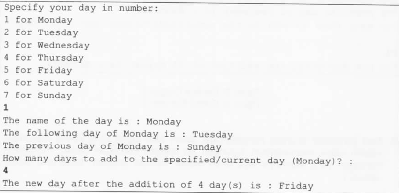
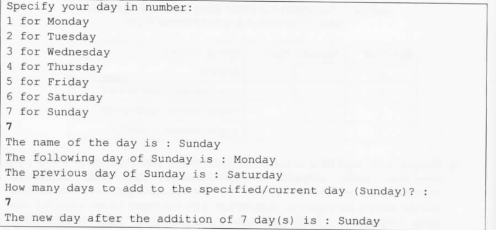
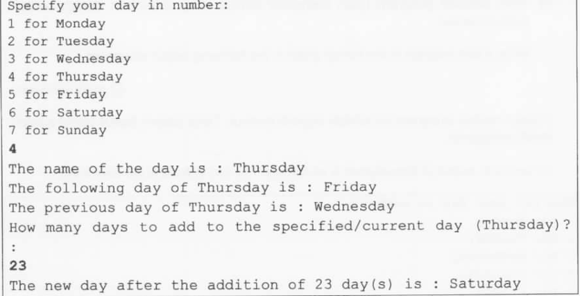
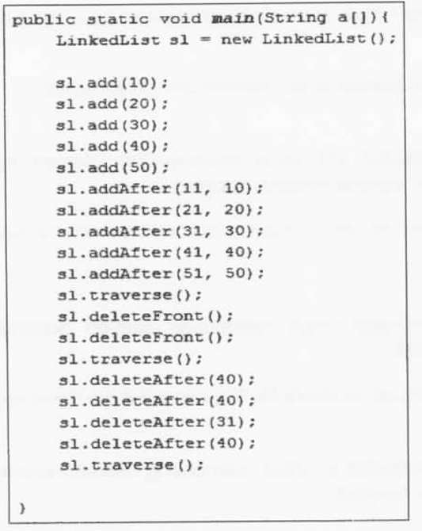
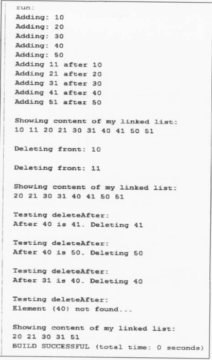

**<ins>June 2016, 3 hours 30 minutes, attempted by Leith</ins>**

1. A week consists of seven days. A class called Day should store the days from
   Monday through Sunday. Design and write a program for days of the week that
   should do the following:<br>

i) Allows user to key-in an input of the day based on numbers such as 1
for Monday and 2 for Tuesday. (i.e. 1 = Monday, 2 = Tuesday, ..., 7 = Sunday).

ii) Display the corresponding full name of the day of (i)

iii) Calculate and display the following and previous days based on
the number entered in (i).

iv) Calculate and return the day by adding certain days to the current day
as specified by (ii). For example, if the current day is Monday and we add four days,
the day to be returned is Friday. Similarly, if the current day is Tuesday and
we add 13 days, the day to be returned is Monday.

Consider all the above given information:

a) Identify the program requirements by representing them using one UML Class for
the Day class. [3 marks]

b) Write a program to implement the Day class following the identified requirements.
[5 marks]

c) Write a test program in the format given in the following output examples. [2 marks]

An example output of the program is as follows. The text in **bold** is the user
input.


Figure 1: Output Example 1


Figure 2: Output Example 2


Figure 3: Output Example 3

```text
UML Diagram
+------------------------+
|         Day            |
+------------------------+
| - dayInt: int          |
| - dayString: String    |
| - days: String[]       |
+------------------------+
| + Day(dayInt: int)     |
| + getToday(): String      |
| + getYesterday(): String  |
| + getTomorrow(): String   |
| + getDay(daysAdded: int): String |
+------------------------+


```

```java
package pastyears.paper2016;

import java.util.Scanner;

public class Day {
    private final int dayInt;
    private final String dayString;

    String[] days = {
            "Monday", "Tuesday", "Wednesday", "Thursday", "Friday", "Saturday", "Sunday"
    };

    public Day(int dayInt) {
        this.dayInt = dayInt;
        int index = Math.abs(dayInt - 1) % 7;
        this.dayString = days[index];
    }

    public String getToday() {
        return dayString;
    }

    public String getYesterday() {
        int index = 0;
        if (dayInt == 1) {
            index = 6; // sunday
        } else {
            index = Math.abs(dayInt - 1) - 1 % 7;
        }
        return days[index];
    }

    public String getTomorrow() {
        int index = dayInt % 7;
        return days[index];
    }

    public String getDay(int daysAdded) {
        int index = Math.abs(dayInt - 1 + daysAdded) % 7;
        return days[index];
    }

    public static void main(String[] args) {
        System.out.println("""
                Specify your day in number:
                1 for Monday
                2 for Tuesday
                3 for Wednesday
                4 for Thursday
                5 for Friday
                6 for Saturday
                7 for Sunday
                """);

        Scanner sc = new Scanner(System.in);
        int choice = sc.nextInt();

        Day day = new Day(choice);
        System.out.println("The name of the day is : " + day.getToday());
        System.out.println("The following day of " + day.getToday() + " is : " + day.getTomorrow());
        System.out.println("The previous day of " + day.getToday() + " is : " + day.getYesterday());

        System.out.println("How many days to add to the specified/current day (" + day.getToday() + ")? : ");
        choice = sc.nextInt();
        System.out.printf("The new day after the addition of %d day (s) is : %s\n", choice, day.getDay(choice));

        sc.close();
    }
}

```

From the perspective of a programmer, one of the most challenging tasks is to match
the left-bracket to the corresponding right-bracket. Some of the commonly used
brackets in writing a program are listed in Table 1.

| Left | Right | Name         |
|------|-------|--------------|
| [    | ]     | Bracket      |
| {    | }     | curly braces |
| (    | )     | parenthesis  |
| <    | \>    | chevron      |

Table 1: Brackets that are commonly in use

a) Devise an algorithm to check whether an input of type string consists of matched
brackets. The algorithm outputs "YES - all matched!" when all left-brackets are matched
by their corresponding right-brackets of the same type. If there exists some brackets that
not matched, the algorithm should output "Not all brackets are matched". If there is no bracket in the input string
, output "There is no bracket in the input". Summarize your algorithm in the form of
pseudo-code. [5 marks]

```text
1. Start 
2. Read inputs/Scan files
3. boolean hasBracket = false
4. Loop through string character by character
5.      If there is left-bracket characters
6.           push to stack
7.            hasBracket = true
8.      Else
9.          If there is matching right-bracket characters with the correct type
10.               pop stack
11.           Else
11.               sout "Not all brackets are matched"  
12.               End program
13. If !hasBracket
14.     sout "There is no bracket in the input"
15. Else if stack is empty
16.     sout "YES - all matched"
17. Else 
18.     sout "Not all brackets are matched"
19. End program
```

b) Translate your pseudo-code into a program, which accepts the input string through
a text file called - BracMatch.txt. The file consists of several lines of texts. An
example of the content of the BracMatch.txt file is as follows: [5 marks]

```text
(x, y; z)
(area<un[der{the}curv]e>nothing)
(DS-{is[my>]}
][
datastructure
```

```java
package pastyears.paper2016;

import java.io.BufferedReader;
import java.io.FileReader;
import java.util.Stack;

public class BracketMatcher {

    private static boolean isBalanced(String s) {
        Stack<Character> st = new Stack<>();
        for (int i = 0; i < s.length(); i++) {
            if (s.charAt(i) == '[' || s.charAt(i) == '{' || s.charAt(i) == '(' || s.charAt(i) == '<') {
                st.push(s.charAt(i));
            } else if (s.charAt(i) == ']' || s.charAt(i) == '}' || s.charAt(i) == ')' || s.charAt(i) == '>') {
                if (!st.empty() && (
                        (st.peek() == '[' && s.charAt(i) == ']') ||
                                (st.peek() == '{' && s.charAt(i) == '}') ||
                                (st.peek() == '(' && s.charAt(i) == ')') ||
                                (st.peek() == '<' && s.charAt(i) == '>'))
                ) {
                    st.pop();
                } else {
                    return false;
                }
            }

        }
        return st.empty(); // true if balanced, false if unbalanced
    }

    private static boolean hasBrackets(String s) {
        for (int i = 0; i < s.length(); i++) {
            if (s.charAt(i) == '[' || s.charAt(i) == '{' || s.charAt(i) == '(' || s.charAt(i) == '<' || s.charAt(i) == ']' || s.charAt(i) == '}' || s.charAt(i) == ')' || s.charAt(i) == '>') {
                return true;
            }
        }
        return false;
    }

    public static void main(String[] args) {
        String filename = "src/pastyears/paper2016/BracMatch.txt";

        try (BufferedReader br = new BufferedReader(new FileReader(filename))) {
            String s = "";
            while ((s = br.readLine()) != null) {
                System.out.println(s);
                if (!hasBrackets(s)) {
                    System.out.println("There is no bracket in the input");
                } else if (isBalanced(s)) {
                    System.out.println("YES - all matched!");
                } else {
                    System.out.println("Not all brackets are matched");
                }
                System.out.println();
            }
        } catch (Exception e) {
            throw new RuntimeException(e);
        }
    }
}

```

3. Queue supports the insert and the remove operations based on the First-in
   First-out policy,

a) Write a program to create a class named Queue<Item>. The class should consist
of methods as specified in Table 2:

Table 2: List of method names and their specification.

| Constructor/Method name     | Specification                                      |
|-----------------------------|----------------------------------------------------|
| Constructor for Queue class | Default constructor                                |
| isEmpty                     | Return whether or not the queue is empty           |
| size                        | Return the size of the queue                       |
| peek                        | Return the value of the first element in the queue |
| enqueue                     | Add element to the bottom of the queue             |
| dequeue                     | Remove element from the top of the queue           |
| toString                    | Print the element in the queue                     |

[11 marks]

```java
package pastyears.paper2016;

public class Queue<E> {
    private static class Node<E> {
        E data;
        Node next;

        Node(E data) {
            this.data = data;
        }
    }

    private Node<E> front, rear;
    private int size;

    public Queue() {
        front = rear = null;
        size = 0;
    }

    public boolean isEmpty() {
        return size == 0;
    }

    public int size() {
        return size;
    }

    public E peek() {
        if (isEmpty()) {
            throw new RuntimeException("Queue is empty.");
        }
        return front.data;
    }

    public void enqueue(E data) {
        Node newNode = new Node(data);
        if (isEmpty()) {
            front = rear = newNode;
        } else {
            rear.next = newNode;
            rear = newNode;
        }
        size++;
    }

    public E dequeue() {
        if (isEmpty()) {
            throw new RuntimeException("Queue is empty.");
        }
        E data = front.data;
        front = front.next;
        if (front == null) {
            rear = null;
        }
        size--;
        return data;
    }

    public String toString() {
        StringBuilder sb = new StringBuilder();
        Node current = front;
        while (current != null) {
            sb.append(current.data).append(" ");
            current = current.next;
        }
        return sb.toString().trim();
    }
}
```

b) Create a method called ChangeOrder(int k) that accepts a parameter of integer k.
This method will remove k - 1 element from the top of a queue and add its corresponding
value to the bottom of the same queue. The k-th element will be added at the bottom of the queue
but will not be removed from the queue. For example, if k=4, then the output should be
40, 50, 60, 70, 80, 90, 10, 20, 30. [2 marks]

```java
public void changeOrder(int k) {
    if (k > size || k <= 0) {
        throw new IllegalArgumentException("Invalid value of k.");
    }

    for (int i = 1; i < k; i++) { // k - 1 elements
        // move k-1 elements from front to rear
        E temp = dequeue();
        enqueue(temp);
    }
}
```

c) Create a test program to fill the queue with the following values [10,20,30,40,50,60,70,80,90].
Call the ChangeOrder method to illustrate your implementation. Print all of
the values. [2 marks]

```java
public static void main(String[] args) {
        /*Create a test program to fill the queue with the following values [10,20,30,40,50,60,70,80,90].
        Call the ChangeOrder method to illustrate your implementation. Print all of
        the values.*/

    Queue<Integer> queue = new Queue<>();
    queue.enqueue(10);
    queue.enqueue(20);
    queue.enqueue(30);
    queue.enqueue(40);
    queue.enqueue(50);
    queue.enqueue(60);
    queue.enqueue(70);
    queue.enqueue(80);
    queue.enqueue(90);

    System.out.println(queue);

    queue.changeOrder(4);
    System.out.println("\nAfter changing order with k = 4");
    System.out.println(queue);

}
```

4. Write a program to create a (singly) linked list using a class called LinkedList, where your main() method is as
   shown in
   Figure 4. Your output is as shown on Figure 5. Your program requires the following methods:

i) Method add(int) to insert a new element into the linked list. [3 marks]

ii) Method addAfter(int, int) to insert a new element after a particular element in the linked
list. [3 marks]

iii) Method deleteFront() to delete the first element in the linked list. [3 marks]

iv) Method deleteAfter(int x) to delete an element after element with value x in the linked list. [3 marks]

v) Method traverse() to display all of the contents of the linked list. [3 marks]

* No marks will be given for any implementation using the existing LinkedList class or any other Collection classes
  available
  from the Java API Library.

  
Figure 4

  
Figure 5

```java
package pastyears.paper2016;

public class LinkedList {
    private static class Node{
        int data;
        Node next;

        public Node(int data){
            this.data = data;
            this.next = null;
        }
    }
    private Node head = null;

    public void add(int data){
        Node newNode = new Node(data);

        if (head == null){
            head = newNode;
            System.out.println("Adding: "+ head.data);
            return;
        }

        Node current = head;
        while (current.next!=null){ // traverse
            current = current.next;
        }

        current.next = newNode;
        System.out.println("Adding: " + data);
    }

    public void addAfter(int data, int target){
        Node current = head;

        while (current!= null && current.data != target){
            current = current.next;
        }

        if (current != null){
            Node newNode = new Node(data);
            newNode.next = current.next;
            current.next = newNode;
            System.out.println("Adding "+ data + " after "+ target);
        } else{
            System.out.println("Element "+ target +" not found.");
        }

    }

    public void deleteFront(){
        if (head!= null){
            System.out.println("Deleting front: " + head.data);
            head = head.next;

        } else{
            System.out.println("LinkedList is empty.");
        }

    }

    public void deleteAfter(int target){
        Node current = head;

        System.out.println("Testing deleteAfter: ");
        while (current != null && current.data != target){
            current = current.next;
        }

        if (current != null && current.next != null){
            System.out.println("After " + target + " is " + current.next.data+". Deleting " + current.next.data);
            current.next = current.next.next;
        } else if (current == null){
            System.out.println("Element (" + target + ") not found.");
        } else{
            System.out.println("No element exists after "+ target + ".");
        }
    }

    public void traverse(){
        Node current = head;
        System.out.println("Showing content of my linked list: ");
        while (current!=null){
            System.out.print(current.data + " ");
            current = current.next;
        }
        System.out.println();
    }

    public static void main(String[] args) {
        LinkedList s1 = new LinkedList();

        s1.add(10);
        s1.add(20);
        s1.add(30);
        s1.add(40);
        s1.add(50);
        s1.addAfter(11, 10);
        s1.addAfter(21, 20);
        s1.addAfter(31, 30);
        s1.addAfter(41, 40);
        s1.addAfter(51, 50);
        System.out.println();
        s1.traverse();
        System.out.println();
        s1.deleteFront();
        System.out.println();
        s1.deleteFront();
        System.out.println();
        s1.traverse();
        System.out.println();
        s1.deleteAfter(40);
        System.out.println();
        s1.deleteAfter(40);
        System.out.println();
        s1.deleteAfter(31);
        System.out.println();
        s1.deleteAfter(40);
        System.out.println();
        s1.traverse();

    }
}

```


