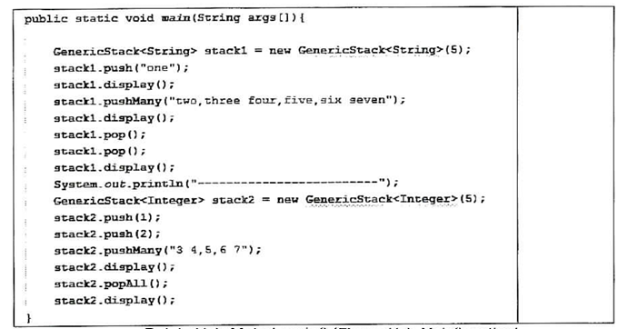
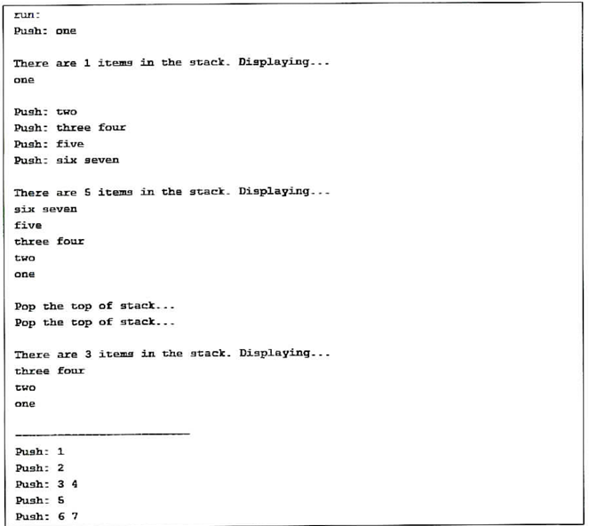
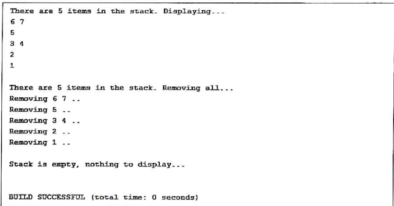
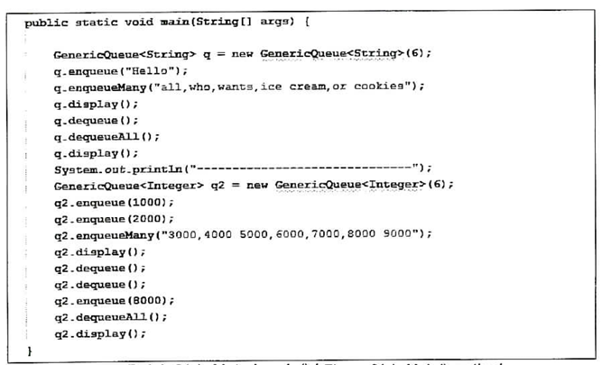
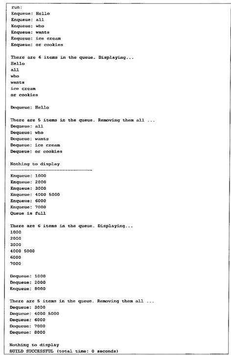
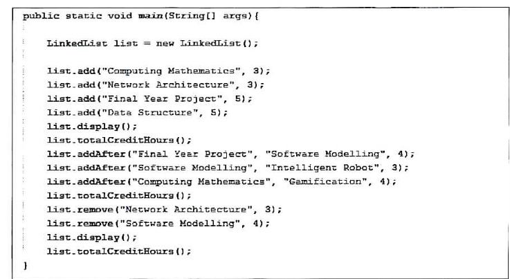
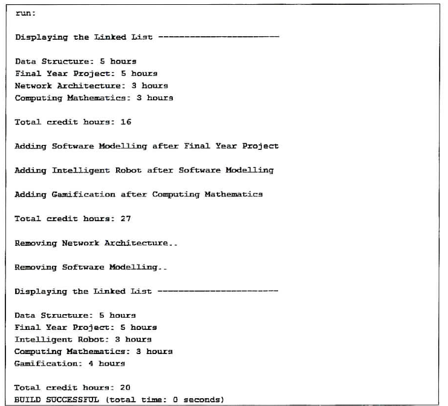
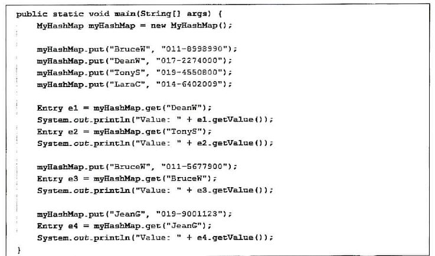
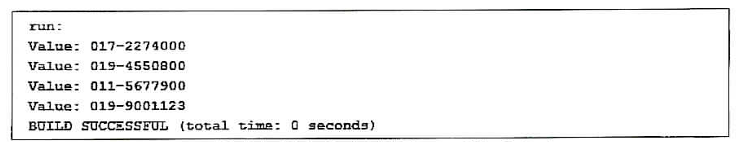

<ins>**Jan 2019, 3 hours 30 minutes, attempted by Leith**</ins> 
QUESTION 1 [14 marks]  
One popular technique in data structure is the generic stack implementation. Write 
a program to implement generic stack. Your program must contain the following methods
(see Table 1).

Table 1: List of method names and their specification

| Constructor/Method name                    | Specification                                                                  |
|--------------------------------------------|--------------------------------------------------------------------------------|
| i) Constructor for the generic stack class | Default constructor                                                            |
| ii) isEmpty                                | Return whether or not the generic stack is empty                               |
| iii) isFull                                | Return whether or not the generic stack is full                                |
| iv) peek                                   | Return the value of the first element in the generic stack without removing it |
| v) push                                    | Add element to the top of generic stack                                        |
| vi) pushMany                               | Add several elements to the generic stack using comma as split delimiter       |
| vii) pop                                   | Remove element from the top of the generic stack                               |
| viii) popAll                               | Remove all elements from the generic stack                                     |
| ix) display                                | Display all elements in the generic stack                                      |

Write your main() method in the same program file. Your main() method should follow the suggestion shown in 
Figure 1(a). Modify and test your methods so you get the same output shown in Figure 1(b).

- No marks will be given for any implementation using the existing Stack class or any 
other Collection classes available from the Java API Library.

QUESTION 2 [14 marks]  
Queue supports the insert and the remove operations based on the First-in First-out 
policy. Write a program to implement generic queue. Your program must contain 
the following methods.

Table 2: List of method names and their specification

| Constructor/Method name                    | Specification                                                            |
|--------------------------------------------|--------------------------------------------------------------------------|
| i) Constructor for the generic queue class | Default constructor                                                      |
| ii) isEmpty                                | Return whether or not the generic queue is empty.                        |
| iii) isFull                                | Return whether or not the generic queue is full                          |
| iv) peek                                   | Return the value of the first element in the generic queue               |
| v) enqueue                                 | Add element to the generic queue                                         |
| vi) enqueueMany                            | Add several elements to the generic queue using comma as split delimiter |
| vii) dequeue                               | Remove element from the generic queue                                    |
| viii) dequeueAll                           | Remove all elements from the generic queue                               |
| ix) display                                | Display all elements in the generic queue                                |

Write your main() method in the same program file. Your main() method should follow
the suggestion shown in Figure 2(a). Modify and test your methods so you get the same output
shown in Figure 2(b).

- No marks will be given for any implementation using the existing Queue class or any other
Collection classes available from the Java API Library.

QUESTION 3 [14 marks]  
One popular technique in data structure is linked list. Write a program using linked list.
Your program must contain the following methods (see Table 3).

Table 3: List of method names and their specification

| Constructor/Method name                  | Specification                                            |
|------------------------------------------|----------------------------------------------------------|
| i) Constructor for the linked list class | Default constructor for the linked list class            |
| ii) Constructor for the node class       | Default constructor for the node class.                  |
| iii) isEmpty                             | Return whether or not the linked list is empty           |
| iv) add                                  | Add element to the linked list                           |
| v) addAfter                              | Add new element after existing element in the linked list |
| vi) remove                               | Remove a particular element from the linked list         |
| vii) display                             | Display all elements in the linked list                  |
| viii) totalCreditHours()                 | Count the total credit hours collected                   |

Write your main() method in the same program file. Your main() method should follow the suggestion shown
in Figure 3(a). Modify and test your methods so you get the same output shown in Figure 3(b).

- No marks will be given for any implementation using the existing Linked List class or any other Collection classes available from the Java API Library.

QUESTION 4 [8 marks]  

HashMap is a structure that stores data in the form of Key and value pairs. Write a program 
to implement HashMap. Your program must contain the following methods.

Table 4: List of method names and their specification

| Constructor/Method name              | Specification                                                                                                                          |
|--------------------------------------|----------------------------------------------------------------------------------------------------------------------------------------|
| i) Constructor for the HashMap class | Default constructor which accepts Key and value pair parameters                                                                        |
| ii) get                              | Return the entry mapped to key in the HashMap                                                                                          |
| iii) put                             | Add new entry if Key is not yet mapped into the HashMap. Otherwise, update entry mapped to Key if the HashMap already contains the Key |

Write your main() method in the same program file. Your main() method should follow the suggestion shown in Figure 4(a). Modify
and test your methods so you get the same output shown in Figure 4(b).

- No marks will be given for any implementation using the existing HashMap class or
any other Collection classes available from the Java API Library. 