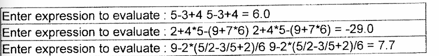
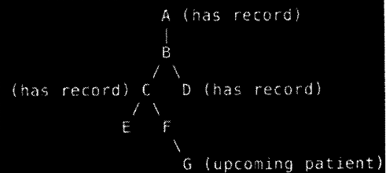
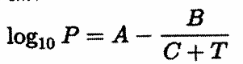
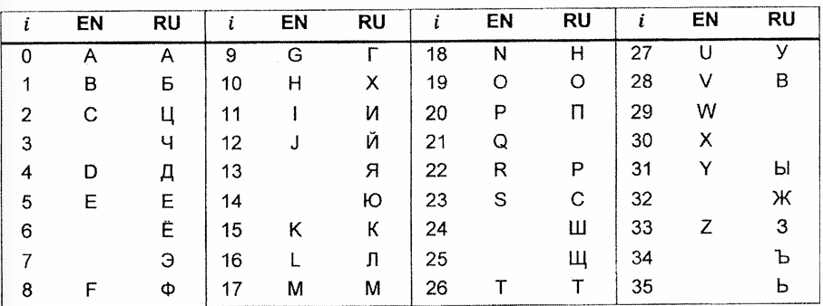
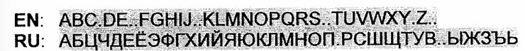
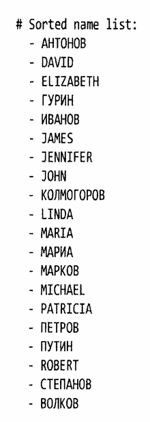
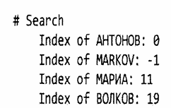
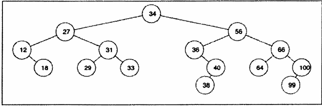

**<ins>July 2023 Paper, 3 hours, attempted by Leith</ins>**<br>
QUESTION 1 [3 marks]<br>
Based on the Java library java.util.LinkedList; develop ExamStack,
a generic stack class. This class should have 4 methods only, i.e.
peep, pop, push and getSize.

```java

```

QUESTION 2 [12 marks]<br>
Arithmetic is an elementary study in mathematics which involves operands and operators.
Fundamental operations involving addition, subtraction, multiplication and division 
are taught in primary education to ensure students build a strong foundation
for other topics in mathematics. To assist students in primary education, you are asked
by their teachers to write a program that reads arithmetic expressions from user inputs
and produces answers immediately. You are required to use only the `ExamStack` class developed 
in Question 1 to solve this problem, and no other data structures are allowed.


You are also required to evaluate the expressions as given, do not convert them to
Polish Notations, Reverse Polish Notations or other forms for evaluations. Since the 
program is developed for primary education, you only need to evaluate addition, 
subtraction, multiplication, division and braces. Furthermore, all the operands are 
single digit positive integers but the output can be real numbers. You can assume the 
inputs from the users are always valid arithmetic expressions, and users will not provide expressions
that involve division by 0.


Sample inputs and outputs of the program are given below.





QUESTION 3 [25 marks]<br>
A family book (`family_book.csv`) is a table that contains the names of all people in the
city, their basic information and their direct parent. And you are a doctor who will see
many patients every week. In your hospital, you have a record of past patients and 
their medical information (`past_medical_record.csv`). By referring to the family book
and the past records, you would like to profile your upcoming patients
(`upcoming_patients.csv`) by looking at an existing medical record of their closest
ancestor (parent / parent of the parent, etc. ) in case there is a possibility of hereditary disease.

An example of the family tree is shown below.



For upcoming patient G, even though A, C and D (ancestors/relatives) have medical 
record, we are only interested in the closest ancestor which is C. Additionally, for 
upcoming patient G, although F is its direct parent, there are no past medical records
for F. Therefore, we need to keep searching patient G's ancestry to find the closest 
ancestor with a medical record, which is C. Since A is at the top of the family tree, you
can assume that the person migrated into the city in the past and thus have no parent information 
in the family book.

**<ins>Assumptions</ins>**

a) there can be no two people with the same name<br>
b) each person can only have one parent listed in the family book<br>
c) one parent can have multiple children<br>
d) having no parent information in the family book means the person migrated into the city (top of the family tree)<br>
e) having the same last name does not guarantee two or more person belongs to 
the same family <br>

**<ins>Examples of Tables</ins>**

All csv files are comma separated with newline separating each rows. The first line of 
each file is always the table header.<br>
- Family Book

| FirstName | LastName | ParentFirstName | ParentLastName |
|-----------|----------|-----------------|----------------|
| Morgana   | Chris    |                 |                |
| Andree    | Alica    |                 |                |
| Malinde   | Giffie   | Lucia           | Giffie         |

Refer to assumption 4 where ParentFirstName and ParentLastName are empty.

- Past Medical Record

| FirstName | LastName | Height | Weight | Occupation | Diabetic | HeartDisease | Smoking | DrinkAlcohol |
|-----------|----------|--------|--------|------------|----------|--------------|---------|--------------|
| Audre     | Edbert   | 153    | 107    | Coil Wirer | Yes      | No           | Yes     | No           |
| Faye      | Nora     | 151    | 60     | Animator   | No       | No           | No      |Yes|


- Upcoming Patients

| FirstName | LastName |
|-----------|----------|
| Rosana    | Blain    |
| Rheba     | Doersten |

**<ins>Expected Output</ins>**

You are required to create a function with `wildcard` arguments to display any type of 
table (the `csv` files or your final answer) in the sample output.

Please use your function above to display your final answer - a table with all upcoming 
patient names, and the names and medical records of their closest ancestor (prefixed "Parent" in the table header).

When no medical records are found in an upcoming patient's ancestry, the columns are
simply filled with "None".

**<ins>Sample output</ins>**

| FirstName | LastName | ParentFirstName | ParentLastName | ParentHeight | ParentOccupation | ParentDiabetic | ParentHeartDisease | ParentSmoking | ParentDrinkAlcohol | | 
|-----------|----------|-----------------|----------------|--------------|------------------|----------------|--------------------|---------------|--------------------|-|
| Dustin    | Bleban   | Margaret        | Bion           | 180          | Office worker    | Yes            | Yes                | No            | Stopped            | |
| Rebecca   | Black    | None            | None           | None         | None             | None           | None               | None          | None               | |

Note that columns are separated by tabs and rows are separated by newline. You can
start with the example codes in `Main.java`. 

QUESTION 4 [20 marks]<br>

The given `IOES_Bachok_14093367,03122014.elab` file is extracted from the LSI
LASTEM Gidas system deployed by the UM Institute of Ocean and Earth Sciences (IOES)
in the Bachok Marine Research Station. The elab file consists of 28 attributes, which include the relative humidity, air 
temperature, atmospheric pressure, wind speed, wind direction, power supply to the AWS system, internal temperature, dew point 
and most importantly, the time when these measurements have been taken.

Your task is to write a program to help oceanographers extract and analyse AWS's 
data. Your program should include the functionalities listed below:

a)<br>
Read the measurement time (Date/time), relative humidity (RELHumidity - Ave), air 
temperature (AIRTemp - Ave), atmospheric pressure (ATMPressure - Ave) wind speed (WindSPEED -
 Ave) and wind direction (WindDIR - RisDir) into a data structure, and print the content on
 the screen as a six columns table.

b)<br>
Remove the noise (i.e. anomalies or outliers caused by sensors faulty or drift) using Moving Median,
with window size 3.

[Hint]: Based on the table below, the value of the third measurement 2, is the median value of the first three measurements [1, 2, 99].

| Timestamp           | Before denoise | After denoise |
|---------------------|----------------|---------------|
| 2014-12-03T02:50:00 | 1              | N/A           |
| 2014-12-03T03:00:00 | 2              | N/A           |
| 2014-12-03T03:10:00 | 99             | 2             |
| 2014-12-03T03:20:00 | 4              | 4             |
| 2014-12-03T03:30:00 | 5              | 5             |
| 2014-12-03T03:40:00 | 6              | 5             |
| 2014-12-03T03:50:00 | 55             | 6             |
| 2014-12-03T04:00:00 | 8              | 8             |
| 2014-12-03T04:10:00 | 9              | 9             |
| 2014-12-03T04:20:00 | 10             | 9             |

c)<br>
Convert the wind direction from degree to cardinal, based on the table below.
As an example, if the wind direction is 24.52 degrees, it should be converted 
to NNE. For overlapping values, the main direction should be used. For instance,
11.25 degree should be N, instead of NNE.

| Cardinal Direction | Degree Direction |
|--------------------|------------------|
| N                  | 348.75 - 11.25   |
| NNE                | 11.25 - 33.75    |
| NE                 | 33.75 - 56.25    |
| ENE                | 56.25 - 78.75    |
| E                  | 78.75 - 101.25   |
| ESE                | 101.25 - 123.75  |
| SE                 | 123.75 - 146.25  |
| SSE                | 146.25 - 168.75  |
| S                  | 168.72 - 191.25  |
| SSW                | 191.25 - 213.75  |
| SW                 | 213.75 - 236.25  |
| WSW                | 236.25 - 258.75  |
| W                  | 258.75 - 281.25  |
| WNW                | 281.25 - 303.75  |
| NW                 | 303.75 - 326.25  |
| NNW                | 326.25 - 348.75  |

d) <br>
Calculate the Saturated Vapor Pressure using the Antoine equation below with the
constants for water: 



where T is temperature in Kelwin (K) and the vapor pressure P is in mmHg. The
constants are given as:

| A       | B       | C       | T<sub>min</sub><sup>o</sup>C | T<sub>max</sub><sup>o</sup>C |
|---------|---------|---------|------------------------------|------------------------------|
| 8.07131 | 1730.63 | 233.426 | 1                            | 99                           |
| 8.14019 | 1810.94 | 244.485 | 100                          | 374                          |

[Hint]: The temperature recorded by the AWS system is in degrees Celcius (<sup>o</sup>C). You
should convert it into Kelvin by adding 273.15.

e) <br>
Lastly, print the content of your data structure, after performing task (b) to (d), with
the saturated vapor pressure added as the 7th column in your table. 


QUESTION 5 [20 marks]<br>
You are given a list of names that contains both English and Russian names. Your task
is to<br>
i) sort the name list according to certain lexicographical order<br>
ii) find the index of specific given names in the sorted list<br>
iii) find the name with the most letters in the list.<br>

Some Russian letters can be written using English letter equivalents, so you must
sort the list using a specific alphabetical order that is provided below:



If two names have the same precedence level should be sorted based on the order they
appear in the given list. For instance, both MARIA (EN) and MAPNA (RU) have the 
same precedence level and should be sorted based on who appears first in the given list. You
can safely assume that all names given will be **CAPITALIZED**. All the names given in this exercise
will have at least one letter and will only contain the characters listed in the table above. Please be 
very careful that some characters may appear similar but have different byte 
codes: A (`\u0041`), A (`\u0410`).

To make it easier, the complete list of letters in the specified order is presented in
a single line shown below, and any empty spaces are represented using `"."`.



a)<br>
For this task, you can begin your work with the main method provided below:
```java
public static void main(String[] args) {
    String[] names = {
            "DAVID", "ELIZABETH", "JAMES", "JENNIFER", "JOHN",
            "LINDA", "MARIA", "MICHAEL", "PATRICIA", "ROBERT",
            "АНТОНОВ", "ВОЛКОВ", "ГУРИН", "ИВАНОВ", "КОЛМОГОРОВ",
            "МАРЧА", "МАРКОВ", "ПЕТРОВ", "ПУТИН", "СТЕПАНОВ"
    };
    
    Comparator<String> comparator = new SpecialComparator<>();
    sort(names, comparator);
    System.out.println("# Sorted name list:\n - ");
    printArray(names, "\n - ");
}
```

As you may have noticed from the code provided, your task is to create a generic 
`Comparator` called `SpecialComparator` with a type parameter that is **upper bounded** by
`CharSequence`. This comparator will determine the order of two given names. Specifically, the compare method will return 
a negative value if the first name should come before the second name, zero if both names have the same 
importance, or a positive value if the first name should come after the second name.

Next, you'll need to write a generic `sort` method that takes an array of generic
type and a `Comparator` object for the comparisons. You're free to use any type of sorting algorithm, including the trivial 
bubble sort.

Finally, you should also write a generic `printArray` method that print each element in a generic array followed
by the given `delimiter`. You should see the following output if your implementation is correct:



b)<br>
For this task, you need to write a generic method `search` that can locate
the index of a given item within an array. The expected output for this task is shown below:




c)<br>
Your final task is to find the longest name in the list. If two or more names are the 
same length, the name that appears first in the list should be considered the answer. To
achieve this, you need to create a generic method called `findMax`. This method should take a generic array and a 
`Comparator` as parameters, and return the index of the maximum element in the array based on the
comparison results from the `Comparator`.

Then, you will need to create a `Comparator` that compares the length of two given strings. You
can do this by either creating a new `Comparator` object or instantiating a `Comparator` object
using an anonymous class expression.

For your information, the longest name in the list is `КОЛМОГОРОВ`, and its index in the sorted list is 8.

**[HINTS]**: `Comparator` is a Java interface that is used to define the total ordering
of the objects. It has two methods `int compare(T o1, T o2)` and `boolean equals(Object obj)`, but we only
need to define the `compare` method. You can define your own custom comparison logic to sort objects
in a specific order.

**Example:**<br>
Sorting an array in descending order.

```java
import java.util.Arrays;
import java.util.Comparator;

class Example{
    public static void main(String[] args) {
        Integer[] array = {20, 10, 77, 36, 39, 98, 34, 96, 44, 64};
        Arrays.sort(array, new Comparator<Integer>(){
            @Override
            public int compare(Integer o1, Integer o2){
                return o2 - o1;
            }
        });
        System.out.println(Arrays.toString(array));
        // [98, 96, 77, 64, 44, 39, 36, 34, 20, 10]
    }
}
```

 
QUESTION 6 [20 marks]<br>
Figure below shows a binary search tree.

### insert a picture here


a)<br>
Write the sequence of the nodes if the tree is traversed with inorder,
preorder and postorder traversal.

b)<br>
In common scenario, deletion of a node in a binary search tree involves looking
for the rightmost node of the left child and replace the deleted node with the rightmost
node found, if a left child exists. Reimplement the solution for node deletion and use leftmost node of the right
child to replace the deleted node instead. Compare the outcome of the original solution and 
the reimplemented solution for the node deletion of "12", "34" and "66".


c)<br>
Conceptually, a binary search tree and a circular doubly linked list looks similar. Both
consist of a node element, and 2 variables that points to another node. Write a program to 
convert a binary search tree to a circular doubly linked list.

**[HINTS]:** A recursive concept could help.