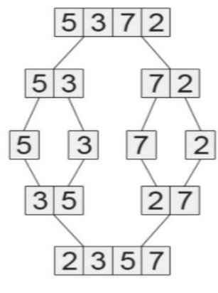
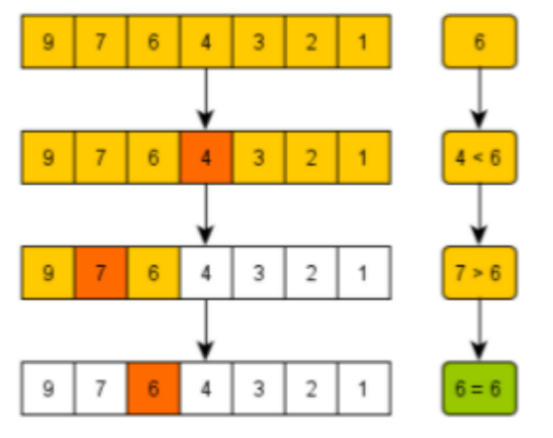
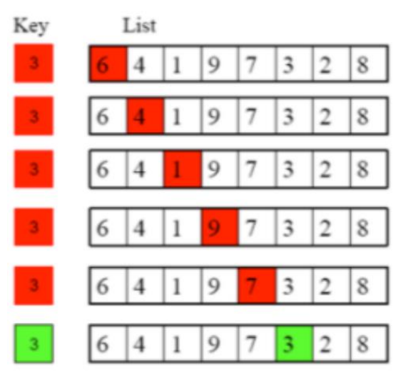

Tutorial: Sorting and searching
1. Compare between linear search and binary search algorithms by searching for the numbers 45 and
   54 in the following list :<br>
   `3 8 12 34 54 85 61 110`

```java
// Linear Search
package week11;

public class LinearSearch {
    private static int linearSearch(int[] list, int key){
        for (int i = 0; i < list.length; i++) {
            if (key == list[i]){
                return i;
            }
        }
        return -1;
    }

    public static void main(String[] args) {
        int[] list = {3,8,12,34,54,85,61,110};
        System.out.println(linearSearch(list, 45)); // return -1
        System.out.println(linearSearch(list, 54)); // return 4
    }
}
```

```java
// binary search
package week11;

public class BinarySearch {
    private static int binarySearch(int[] list, int key){
        int low = 0;
        int high = list.length;

        while (high>= low){
            int mid = (low + high) / 2;
            if (key < list[mid]){
                high = mid - 1;
            } else if (key == list[mid]){
                return mid;
            } else{
                low = mid + 1;
            }
        }
        return -1;
    }

    public static void main(String[] args) {
        int[] list = {3, 8, 12, 34, 54, 85, 61, 110};
        SelectionSort a = new SelectionSort();
        a.selectionSort(list);

        System.out.println(binarySearch(list,45)); // -1
        System.out.println(binarySearch(list,54)); // 4
    }
}
```

2. Describe the technique for each sort algorithm below. Given the following list:<br>
   `90 8 7 56 125 237 9 1 653`<br>
   Show a trace of execution for:<br>
   a. Selection sort<br>

Trace:

Find min in `[90, 8, 7, 56, 125, 237, 9, 1, 653]` → 1  
Swap with 90 → `[1, 8, 7, 56, 125, 237, 9, 90, 653]`

Find min in `[8, 7, 56, 125, 237, 9, 90, 653]` → 7  
Swap with 8 → `[1, 7, 8, 56, 125, 237, 9, 90, 653]`  

Find min in `[8, 56, 125, 237, 9, 90, 653]` → 8  
No swap needed  

Find min in `[56, 125, 237, 9, 90, 653]` → 9  
Swap with 56 → `[1, 7, 8, 9, 125, 237, 56, 90, 653]`  

Find min in `[125, 237, 56, 90, 653]` → 56  
Swap with 125 → `[1, 7, 8, 9, 56, 237, 125, 90, 653]`  

Find min in `[237, 125, 90, 653]` → 90  
Swap with 237 → `[1, 7, 8, 9, 56, 90, 125, 237, 653]`

Find min in `[125, 237, 653]` → 125 → No swap  

Find min in `[237, 653]` → 237 → No swap  

Sorted: `[1, 7, 8, 9, 56, 90, 125, 237, 653]`


   b. Insertion sort<br>
Trace:

Start with `[90]` | `8 7 56 125 237 9 1 653`

Insert 8 → `[8, 90]` | `7 56 125 237 9 1 653`

Insert 7 → `[7, 8, 90]` | `56 125 237 9 1 653`

Insert 56 → `[7, 8, 56, 90]` | `125 237 9 1 653`

Insert 125 → `[7, 8, 56, 90, 125]` | `237 9 1 653`

Insert 237 → `[7, 8, 56, 90, 125, 237]` | `9 1 653`

Insert 9 → `[7, 8, 9, 56, 90, 125, 237]` | `1 653`

Insert 1 → `[1, 7, 8, 9, 56, 90, 125, 237]` | `653`

Insert 653 → `[1, 7, 8, 9, 56, 90, 125, 237, 653]`

Sorted: `[1, 7, 8, 9, 56, 90, 125, 237, 653]`


   c. Bubble sort<br>

Pass 1:<br>
90 > 8 → `[8, 90, 7, 56, 125, 237, 9, 1, 653]`

90 > 7 → `[8, 7, 90, 56, 125, 237, 9, 1, 653]`

90 > 56 → `[8, 7, 56, 90, 125, 237, 9, 1, 653]`

90 < 125 → `OK`

125 < 237 → `OK`

237 > 9 → `[8, 7, 56, 90, 125, 9, 237, 1, 653]`

237 > 1 → `[8, 7, 56, 90, 125, 9, 1, 237, 653]`

237 < 653 → `OK`

Pass 2:<br>
8 > 7 → `[7, 8, 56, 90, 125, 9, 1, 237, 653]`

8 < 56 → `OK`

56 < 90 → `OK`

90 < 125 → `OK`

125 > 9 → `[7, 8, 56, 90, 9, 125, 1, 237, 653]`

125 > 1 → `[7, 8, 56, 90, 9, 1, 125, 237, 653]`

Pass 3:<br>
7 < 8 → `OK`

8 < 56 → `OK`

56 < 90 → `OK`

90 > 9 → `[7, 8, 56, 9, 90, 1, 125, 237, 653]`

90 > 1 → `[7, 8, 56, 9, 1, 90, 125, 237, 653]`

...continue until no swaps.

Sorted: `[1, 7, 8, 9, 56, 90, 125, 237, 653]`

   d. Merge sort<br>
Trace:<br>
Split → `[90, 8, 7, 56]` and `[125, 237, 9, 1, 653]`

Left Half `[90, 8, 7, 56]`<br>
Split → `[90, 8]` and `[7, 56]`

Sort `[90, 8]` → `[8, 90]`

Sort `[7, 56]` → `[7, 56]`

Merge → `[7, 8, 56, 90]`

Right Half `[125, 237, 9, 1, 653]`<br>
Split → `[125, 237]` and `[9, 1, 653]`

Sort `[125, 237]` → `[125, 237]`

Sort `[9, 1, 653]`

Split → `[9]` and `[1, 653]`

Sort `[1, 653]` → `[1, 653]`

Merge → `[1, 9, 653]`

Merge → `[1, 9, 125, 237, 653]`

Final Merge:

Merge `[7, 8, 56, 90]` and `[1, 9, 125, 237, 653]` →<br>
→ `[1, 7, 8, 9, 56, 90, 125, 237, 653]`

Sorted: `[1, 7, 8, 9, 56, 90, 125, 237, 653]`

3. Which type of sort algorithm is this?
<br>
`Merge sort`


4. Which type of search algorithm is this?
<br>
`Binary Search`


5. Which type of search algorithm is this?

`Linear Search`