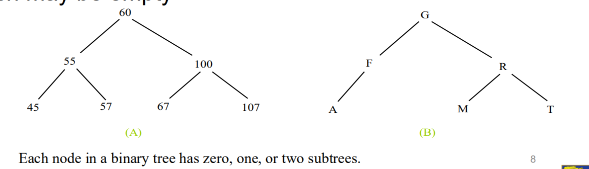

**<ins>Tutorial: Binary Search Tree</ins>**

1. What is a binary search tree (BST)? 
= A binary tree is a hierarchical structure. It is either empty or consists of an element, 
called the root, and two distinct binary trees, called the left subtree and right subtree,
either or both of which may be empty. 

2. Build a BST based on the input 50, 30, 25, 71, 80, 99, 40, 1, 7, 5. Draw the final tree.

3. What is the height of the tree built in Question 2? 
= Determined by the longest path from root to a leaf. Longest path = 5 edges 
height of the BST = 5

4. Given the following BST, list the items in the order of: 

(a) Pre-order traversal 

`0100 -> 0050 -> 0025 -> 0001 -> 0030 -> 0070 -> 0065 -> 0085 -> 0150 -> 0135 -> 0169 -> 0180`

(b) In-Order traversal 

`0001 -> 0025 -> 0030 -> 0050 -> 0065 -> 0070 -> 0085 -> 0100 -> 0135 -> 0150 -> 0169 -> 0180`

(c) Post-order traversal 

`0001 -> 0030 -> 0025 -> 0065 -> 0085 -> 0070 -> 0050 -> 0135 -> 0180 -> 0169 -> 0150 -> 0100`

5. Using the same BST in Question 4, delete the element `0030’. Draw the resulting tree.

6. Again, using the same BST in Question 3 (i.e., ignoring the deletion of '0030' in Question 5),
delete the element '0050'. Draw the resulting tree.

