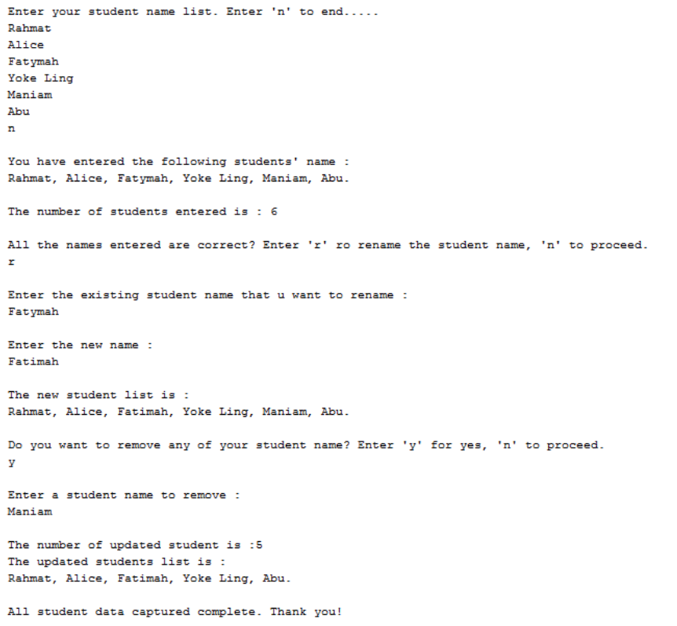
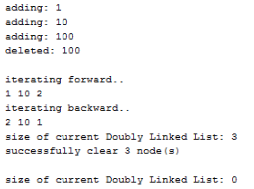

**<ins>Lab: Linked List/Doubly LinkedList</ins>**<br>

Q1<br>
Create a package called SList and implement a node class called SNode<E>. The SNode<E>
class consists of two constructors, respectively, a default constructor and a constructor that
receives a generic item.<br>
1) Initialise the variables appropriately in each constructor.
2) Create a generic class called SList<E> and include the necessary declaration in the
   SList<E> class.
3) Implement the following methods in class SList<E>:<br>

i. public void appendEnd(E e)  
   Append a new element at the end of the list.

   ii. public E removeInitial()  
   Eliminate the first element in the list.

iii. public boolean contains(E e)  
Search for an element and returns true if this list contains the searched element

iv. public void clear()  
Empty all elements in the list and return a statement that reports that the list is
empty.

v. public void display()  
Display all values from the list in a successive order.

4) Write a test program called TestSList in the SList package. Using the appropriate
   methods you implemented in SList<E>, do the following:  

   1) Append the following values individually: “Linked list, is, easy.”
   2) Display these values.
   3) Remove the word “Linked list” and display the removed value.
   4) Check if ‘difficult’ is in the list.
5) Clear the list.

SNode.java👇
```java
package SList;

public class SNode<E> {
    E element;
    SNode<E> next;

    // Default constructor
    public SNode() {
        this.element = null;
        this.next = null;
    }

    // Constructor with item
    public SNode(E element) {
        this.element = element;
        this.next = null;
    }
}
```

SList.java👇
```java
package SList;

public class SList<E> {
    private SNode<E> head;

    public SList() {
        this.head = null;
    }

    // Append to end
    public void appendEnd(E e) {
        SNode<E> newNode = new SNode<>(e);
        if (head == null) {
            head = newNode;
        } else {
            SNode<E> current = head;
            while (current.next != null) {
                current = current.next;
            }
            current.next = newNode;
        }
    }

    // Remove first element
    public E removeInitial() {
        if (head == null) {
            return null;
        }
        E removed = head.element;
        head = head.next;
        return removed;
    }

    // Check if list contains an element
    public boolean contains(E e) {
        SNode<E> current = head;
        while (current != null) {
            if (current.element.equals(e)) {
                return true;
            }
            current = current.next;
        }
        return false;
    }

    // Clear the list
    public void clear() {
        head = null;
        System.out.println("The list has been cleared.");
    }

    // Display the list
    public void display() {
        SNode<E> current = head;
        while (current != null) {
            System.out.print(current.element + " ");
            current = current.next;
        }
        System.out.println();
    }
}
```

TestSList.java👇
```java
package SList;

public class TestSList {
    public static void main(String[] args) {
        SList<String> list = new SList<>();

        // 1. Append elements
        list.appendEnd("Linked list");
        list.appendEnd("is");
        list.appendEnd("easy.");

        // 2. Display list
        System.out.print("List contents: ");
        list.display();

        // 3. Remove "Linked list"
        String removed = list.removeInitial();
        System.out.println("Removed element: " + removed);

        // 4. Check for "difficult"
        System.out.println("Contains 'difficult'? " + list.contains("difficult"));

        // 5. Clear the list
        list.clear();
    }
}
```

Q2
A kindergarten needs to use an online student management system enabling its admin staff to
manage their student list. Write a program using singly linked list to demonstrate the following:
i) public void add(E e)
ii) public void removeElement(E e)
iii) public void printList()
iv) public int getSize()
v) public boolean contains(E e)
vi) public void replace(E e, E newE)
The program should demonstrate the following functions:
 Admin staff shall be able to interact with the program. The admin staff should enter a list
of student’s names.
 Display the list of the entered student’s names.
 Calculate the number of students in the list.
 Rename existing student’s name in the list with the new one specified by the admin staff.
 Delete a student name as specified by the admin staff.
Sample Output

<br>

StudentList.java👇
```java
import java.util.Scanner;

public class StudentList<E> {
    private class Node {
        E data;
        Node next;

        Node(E data) {
            this.data = data;
            this.next = null;
        }
    }

    private Node head;
    private int size;

    public StudentList() {
        this.head = null;
        this.size = 0;
    }

    // i) Add student
    public void add(E e) {
        Node newNode = new Node(e);
        if (head == null) {
            head = newNode;
        } else {
            Node current = head;
            while (current.next != null)
                current = current.next;
            current.next = newNode;
        }
        size++;
    }

    // ii) Remove student
    public void removeElement(E e) {
        if (head == null) return;

        if (head.data.equals(e)) {
            head = head.next;
            size--;
            return;
        }

        Node current = head;
        while (current.next != null && !current.next.data.equals(e)) {
            current = current.next;
        }

        if (current.next != null) {
            current.next = current.next.next;
            size--;
        }
    }

    // iii) Print all students
    public void printList() {
        Node current = head;
        if (current == null) {
            System.out.println("The student list is empty.");
            return;
        }

        System.out.println("Student List:");
        while (current != null) {
            System.out.println("- " + current.data);
            current = current.next;
        }
    }

    // iv) Get number of students
    public int getSize() {
        return size;
    }

    // v) Check if a student exists
    public boolean contains(E e) {
        Node current = head;
        while (current != null) {
            if (current.data.equals(e))
                return true;
            current = current.next;
        }
        return false;
    }

    // vi) Replace student name
    public void replace(E e, E newE) {
        Node current = head;
        while (current != null) {
            if (current.data.equals(e)) {
                current.data = newE;
                return;
            }
            current = current.next;
        }
    }
}
```

Main.java👇
```java
import java.util.Scanner;

public class Main {
    public static void main(String[] args) {
        StudentList<String> students = new StudentList<>();
        Scanner scanner = new Scanner(System.in);
        String choice;

        System.out.println("Welcome to Kindergarten Student Management System");
        do {
            System.out.println("\nMenu:");
            System.out.println("1. Add student");
            System.out.println("2. Remove student");
            System.out.println("3. Display student list");
            System.out.println("4. Get number of students");
            System.out.println("5. Check if student exists");
            System.out.println("6. Rename a student");
            System.out.println("7. Exit");
            System.out.print("Enter choice (1-7): ");
            choice = scanner.nextLine();

            switch (choice) {
                case "1":
                    System.out.print("Enter student name to add: ");
                    students.add(scanner.nextLine());
                    break;
                case "2":
                    System.out.print("Enter student name to remove: ");
                    students.removeElement(scanner.nextLine());
                    break;
                case "3":
                    students.printList();
                    break;
                case "4":
                    System.out.println("Number of students: " + students.getSize());
                    break;
                case "5":
                    System.out.print("Enter student name to search: ");
                    System.out.println("Exists? " + students.contains(scanner.nextLine()));
                    break;
                case "6":
                    System.out.print("Enter current student name: ");
                    String oldName = scanner.nextLine();
                    System.out.print("Enter new name: ");
                    String newName = scanner.nextLine();
                    students.replace(oldName, newName);
                    break;
                case "7":
                    System.out.println("Exiting the system.");
                    break;
                default:
                    System.out.println("Invalid choice. Please try again.");
            }

        } while (!choice.equals("7"));

        scanner.close();
    }
}
```
Q3
1) Implement all the DoublyLinked List methods in the lecture’s slide. Write a test program
   by using the appropriate methods, do the following:
1) Add first node with value of 1
2) Add last node with value of 100
3) Add node with value of 2 at position index of 2
4) Remove node at position index of 3
5) Traverse Forward
6) Traverse Backward
7) Print current size of linked list
8) Clear all nodes in the linked list
9) Print again current size of linked list
   Sample Output:

<br>

DoublyLinkedList.java👇
```java
public class DoublyLinkedList<E> {
    private class Node {
        E data;
        Node prev, next;

        Node(E data) {
            this.data = data;
        }
    }

    private Node head, tail;
    private int size;

    public DoublyLinkedList() {
        head = tail = null;
        size = 0;
    }

    // 1) Add to front
    public void addFirst(E data) {
        Node newNode = new Node(data);
        if (head == null) {
            head = tail = newNode;
        } else {
            newNode.next = head;
            head.prev = newNode;
            head = newNode;
        }
        size++;
    }

    // 2) Add to end
    public void addLast(E data) {
        Node newNode = new Node(data);
        if (tail == null) {
            head = tail = newNode;
        } else {
            tail.next = newNode;
            newNode.prev = tail;
            tail = newNode;
        }
        size++;
    }

    // 3) Add at index (1-based index)
    public void addAtIndex(int index, E data) {
        if (index < 1 || index > size + 1) {
            System.out.println("Invalid index.");
            return;
        }

        if (index == 1) {
            addFirst(data);
        } else if (index == size + 1) {
            addLast(data);
        } else {
            Node newNode = new Node(data);
            Node current = head;
            for (int i = 1; i < index - 1; i++) {
                current = current.next;
            }

            newNode.next = current.next;
            newNode.prev = current;
            current.next.prev = newNode;
            current.next = newNode;

            size++;
        }
    }

    // 4) Remove at index (1-based index)
    public void removeAtIndex(int index) {
        if (index < 1 || index > size) {
            System.out.println("Invalid index.");
            return;
        }

        if (index == 1) {
            if (head == tail) {
                head = tail = null;
            } else {
                head = head.next;
                head.prev = null;
            }
        } else if (index == size) {
            tail = tail.prev;
            tail.next = null;
        } else {
            Node current = head;
            for (int i = 1; i < index; i++) {
                current = current.next;
            }

            current.prev.next = current.next;
            current.next.prev = current.prev;
        }

        size--;
    }

    // 5) Traverse forward
    public void traverseForward() {
        System.out.print("Forward: ");
        Node current = head;
        while (current != null) {
            System.out.print(current.data + " ");
            current = current.next;
        }
        System.out.println();
    }

    // 6) Traverse backward
    public void traverseBackward() {
        System.out.print("Backward: ");
        Node current = tail;
        while (current != null) {
            System.out.print(current.data + " ");
            current = current.prev;
        }
        System.out.println();
    }

    // 7) Get size
    public int getSize() {
        return size;
    }

    // 8) Clear list
    public void clear() {
        head = tail = null;
        size = 0;
    }
}
```

TestDoublyLinkedList.java 👇
```java
public class TestDoublyLinkedList {
    public static void main(String[] args) {
        DoublyLinkedList<Integer> list = new DoublyLinkedList<>();

        // 1) Add first node with value 1
        list.addFirst(1);

        // 2) Add last node with value 100
        list.addLast(100);

        // 3) Add node with value 2 at index 2
        list.addAtIndex(2, 2);

        // 4) Remove node at index 3
        list.removeAtIndex(3);

        // 5) Traverse forward
        list.traverseForward();

        // 6) Traverse backward
        list.traverseBackward();

        // 7) Print size
        System.out.println("Current size: " + list.getSize());

        // 8) Clear the list
        list.clear();

        // 9) Print size again
        System.out.println("Size after clearing: " + list.getSize());
    }
}
```