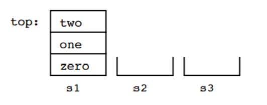

**<ins>Tutorial: Stack & Problem Solving with Stacks</ins>**<br>
Question 1
```text
The stack method that returns an element from the stack without removing it is ____________.
    a. pop
    b. push
    c. peek
    d. spy
```
Answer is C.✔️

Question 2
We have three stacks, s1, s2 and s3, that can contain data of type String. Here are their initial contents:<br>
<br>
As you can see, initially s2 and s3 are empty. Here is a sequence of operations on the three stacks:<br>
```text
s2.push(s1.pop());
s3.push(s1.pop());
s1.pop();
s1.push(s2.pop());
s2.push(s3.pop());
s2.push(s1.pop());
```
Draw the contents of the three stacks after the operations are complete.
```text
Stack s1:       Stack s2:       Stack s3:
empty           top → "two"     empty
                      "one"
```

Question 3:<br>
Over time, the elements 1, 2, and 3 are pushed onto a stack in that order. For each of the following,
indicate (yes or no) whether the sequence could be created by popping operations. If yes, list the
sequence of push() and pop() operations that produces the sequence.<br>
```text
(a) 1-2-3 
(b) 2-3-1 
(c) 3-2-1 
(d) 1-3-2
```
a) yes: push(1), pop(), push(2), pop(), push(3), pop()<br>
b) yes: push(1), push(2), pop(), push(3), pop(), pop()<br>
c) yes: push(1), push(2), push(3), pop(), pop(), pop()<br>
d) yes: push(1), pop(), push(2), push(3), pop(), pop()<br>


Question 4:<br>
Convert the following infix expressions to postfix:<br>
```text
a) a + b * c
b) a * b – c/d
c) a + (b*c + d)/e
```
Answer:<br>
a) abc * +<br> 
b) ab * cd / -<br>
c) a bc * d + e / +

Question 5:<br>
Write the following expressions in infix form:<br>
```text
a) a b + c *
b) a b c + *
```
Answer:<br>
a) (a + b) * c<br>
b) a * (b + c)<br>

Question 6:<br>
Which of the following is an application of stack?<br>

```text
A. finding factorial
B. tower of Hanoi
C. infix to postfix
D. all of the above
```

Answer is D. (all the above)