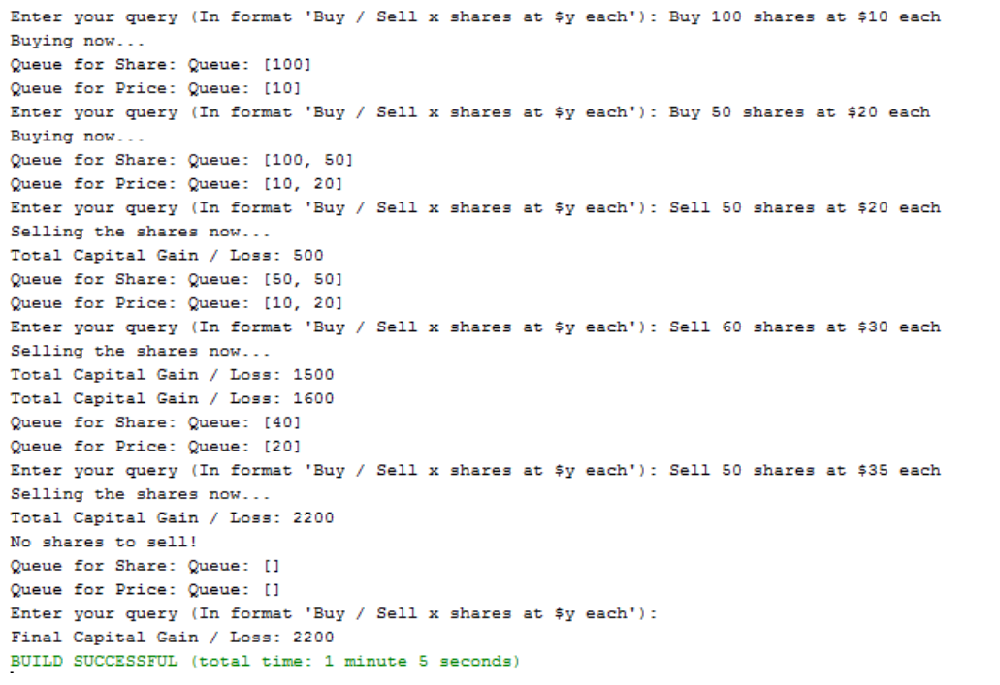

**<ins>Lab: Queue</ins>**

Question 1

a) Write a generic queue class called MyQueue using LinkedList. Implement the following
methods:<br>

a. public MyQueue(E[] e)<br>
b. public MyQueue()<br>
c. public void enqueue(E e)<br>
d. public E dequeue()<br>
e. public E getElement(int i)<br>
f. public E peek()<br>
g. public int getSize()<br>
h. public boolean contains(E e)<br>
i. public boolean isEmpty();<br>
j. public String tostring()<br>

```java
package week7;
import java.util.LinkedList;

public class MyQueue<E> {
    private LinkedList<E> list;
//a. public MyQueue(E[] e)
    public MyQueue(E[] e){
        list = new LinkedList<>();
        for (E item: e){
            list.add(item);
        }
    }
    
//b. public MyQueue()
    public MyQueue(){
        list = new LinkedList<>();
    }
    
//c. public void enqueue(E e)
    public void enqueue(E e){
        list.addLast(e);
    }
    
//d. public E dequeue()
    public E dequeue(){
        if(!isEmpty()){
            return list.removeFirst();
        }
        return null;
    }
    
//e. public E getElement(int i)
    public E getElement(int i){
        if (i>=0 && i< list.size()){
            return list.get(i);
        }
        return null;
    }
    
//f. public E peek()
    public E peek(){
        if (!isEmpty()){
            return list.getFirst();
        }
        return null;
    }
    
//g. public int getSize()
    public int getSize(){
        return list.size();
    }
    
//h. public boolean contains(E e)
    public boolean contains(E e){
        return list.contains(e);
    }
    
//i. public boolean isEmpty();
    public boolean isEmpty(){
        return list.isEmpty();
    }
    
//j. public String tostring()
    public String toString(){
        return list.toString();
    }
}
```

b) Write a test program that : 

a. Have an initialize queue items consists of Durian and Blueberry in a fruitQ<br>
b. Then add new items in the following order: Apple, Orange, Grapes, Cherry.<br>
c. Display the queue.<br>
d. Show the top item.<br>
e. Get the queue size.<br>
f. Delete Durian.<br>
g. Get item in index position of 2<br>
h. Check whether the queue consists of Cherry<br>
i. Check whether the queue consists of Durian<br>
j. Display the queue using the isEmpty() condition.<br>

```java
package week7;

public class MyQueueTest {
    public static void main(String[] args) {
//        a. Have an initialize queue items consists of Durian and Blueberry in a fruitQ
        String[] initiallizeFruits = {"Durian", "Blueberry"};
        MyQueue<String> fruitQueue = new MyQueue<>(initiallizeFruits);

//        b. Then add new items in the following order: Apple, Orange, Grapes, Cherry.
        fruitQueue.enqueue("Apple");
        fruitQueue.enqueue("Orange");
        fruitQueue.enqueue("Grapes");
        fruitQueue.enqueue("Cherry");

//        c. Display the queue.
        System.out.println("Queue: " + fruitQueue.toString());

//        d. Show the top item.
        System.out.println("Top item: " +fruitQueue.peek());

//        e. Get the queue size.
        System.out.println("Queue size: "+ fruitQueue.getSize());

//        f. Delete Durian.
        MyQueue<String> tempQueue = new MyQueue<>();
        while(!fruitQueue.isEmpty()){
            String item = fruitQueue.dequeue();
            if(!item.equals("Durian")){
                tempQueue.enqueue(item);
            }
        }
        fruitQueue = tempQueue;
        System.out.println("After removing Durian: " + fruitQueue.toString());

//        g. Get item in index position of 2
        System.out.println("Item in position 2 : " + fruitQueue.getElement(2));

//        h. Check whether the queue consists of Cherry
        System.out.println("Cherry in the queue : " + fruitQueue.contains("Cherry"));

//        i. Check whether the queue consists of Durian
        System.out.println("Durian in the queue : " + fruitQueue.contains("Durian"));

//        j. Display the queue using the isEmpty() condition
        if (!fruitQueue.isEmpty()){
            System.out.println("Final Queue: " + fruitQueue.toString());
        } else{
            System.out.println("Queue is empty.");
        }
    }
}
```

Question 2<br>
Write a Java program that uses a Queue to determine if the input string is a palindrome or not.
```java
package week7;
import java.util.LinkedList;
import java.util.Queue;

public class QueueIsPalindrome {
    private static boolean isPalindrome(String str){
        str = str.toLowerCase();
        Queue<Character> queue = new LinkedList<>();

        for (char c : str.toCharArray()){
            if (Character.isLetterOrDigit(c)){
                queue.offer(c);
            }
        }

        StringBuilder reversedStr = new StringBuilder();
        while(!queue.isEmpty()){
            reversedStr.append(queue.poll());
        }
        String cleanedStr = str.replaceAll("[^a-zA-Z0-9]","");
        return cleanedStr.equals(reversedStr.reverse().toString()); // if the reverse is the same as reverse of the reverse
    }

    public static void main(String[] args) {
        String[] testCases = {
                "race car",
                "not a palindrome",
                "A man, a plan, a canal. Panama",
                "never odd or even",
                "nope",
                "almostomla",
                "My age is 0, 0 si ega ym.",
                "1 eye for of 1 eye.",
        };

        for (int i = 0; i < testCases.length; i++) {
            System.out.println("Is \"" + testCases[i] + "\" palindrome: " + isPalindrome(testCases[i]));
        }
    }
}
```

Question 3<br>
When a share of common stock of some company is sold, the capital gain or loss is obtained by
calculating the difference between the share’s selling price and the price originally paid to buy
it. This rule is easy to understand for a single share. However, if we sell multiple shares of stock
bought over a long period of time, then we must identify the shares actually being sold. A
standard accounting principle for identifying which shares of a stock were sold in such a case is
to use a FIFO protocol – the shares sold are the ones that have been held the longest.  

For example, suppose we buy 100 shares at \$20 each on day 1, 20 shares at \$24 on day 2, 200
shares at \$36 on day 3, and then sell 150 shares on day 4 at \$30 each. Then applying the FIFO
protocol means that of the 150 shares sold, 100 were bought on day 1, 20 were bought on day
2, and 30 were bought on day 3. The capital gain or loss in this case would therefore be (100 * 10) + (20* 6) + (30 * -6) = \$940.

Write a program that takes as input a sequence of transactions of the form “buy x share(s) at \$y
each” or “sell x share(s) at \$y each,” assuming that the transactions occur on consecutive days
and the value x and y are integers. Given this input sequence, the output should be the total
gain or loss for the sequence, using the FIFO protocol to identify shares.
Example Output (Note: the example output is only for your reference purposes; you may solve
the aforementioned problem with different approaches):



```java
```