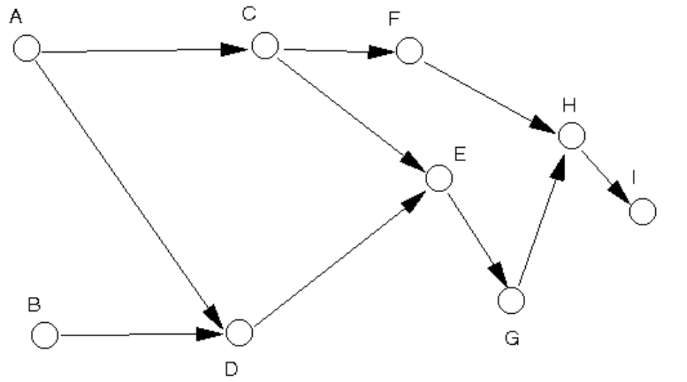

**<ins>Tutorial: Graph</ins>**

1. Write an adjacency matrix and an adjacency list for the following graph12.



Adjacency Matrix:

|   | A | B | C | D | E | F | G | H | I |
|---|---|---|---|---|---|---|---|---|---|
| A | 0 | 0 | 1 | 1 | 0 | 0 | 0 | 0 | 0 |
| B | 0 | 0 | 0 | 1 | 0 | 0 | 0 | 0 | 0 |
| C | 0 | 0 | 0 | 0 | 1 | 1 | 0 | 0 | 0 |
| D | 0 | 0 | 0 | 0 | 1 | 0 | 0 | 0 | 0 |
| E | 0 | 0 | 0 | 0 | 0 | 0 | 1 | 0 | 0 |
| F | 0 | 0 | 0 | 0 | 0 | 0 | 0 | 1 | 0 |
| G | 0 | 0 | 0 | 0 | 0 | 0 | 0 | 1 | 0 |
| H | 0 | 0 | 0 | 0 | 0 | 0 | 0 | 0 | 1 |
| I | 0 | 0 | 0 | 0 | 0 | 0 | 0 | 0 | 0 |


Adjacency List
```text
A : C, D
B : D
C : E, F
D : E
E : G
F : H
G : H
H : I
I : (none)
```

2. Represent the graph12 in question 1 using a 2 dimensional array. You use the adjacency matrix or the adjacency list for this purpose?
```java
package week8;

// Use Adjacency Matrix because its conveniently 2D array.
public class GraphMatrix{
    public static void main(String[] args) {
        int [][] graph12 ={
                {0,0,1,1,0,0,0,0,0}, // A
                {0,0,0,1,0,0,0,0,0}, // B
                {0,0,0,0,1,1,0,0,0}, // C
                {0,0,0,0,1,0,0,0,0}, // D
                {0,0,0,0,0,0,1,0,0}, // E
                {0,0,0,0,0,0,0,1,0}, // F
                {0,0,0,0,0,0,0,1,0}, // G
                {0,0,0,0,0,0,0,0,1}, // H
                {0,0,0,0,0,0,0,0,0}, // I
        };

        printGraph(graph12);
    }

    private static void printGraph(int[][] arr){
        for (int i = 0; i < arr.length; i++) {
            for (int j = 0; j < arr[i].length; j++) {
                System.out.print(arr[i][j] + " ");
            }
            System.out.println();
        }
    }
}
```

3. Write code to create the graph12 using linked-list representation. You use the adjacency matrix or the adjacency list for this purpose?<br>
Use adjacency list because linked-list.

```java
package week8;
import java.util.LinkedList;

public class GraphList {
    private static final int V = 9;

    LinkedList<Integer>[] adjList;

    public GraphList(){
        adjList = new LinkedList[V];
        for (int i = 0; i < V; i++) {
            adjList[i] = new LinkedList<>();
        }
    }

    public void addEdge(int src, int dest){
        adjList[src].add(dest);
    }

    public void printGraph(){
        char[] labels = {'A','B','C','D','E','F','G','H','I'};
        for (int i = 0; i < V; i++) {
            System.out.print(labels[i] + ": ");
            for (int node: adjList[i]) {
                System.out.print(labels[node] +  " ");
            }
            System.out.println();
        }
    }

    public static void main(String[] args) {
        GraphList grph = new GraphList();

//        A : C, D
//B : D
//C : E, F
//D : E
//E : G
//F : H
//G : H
//H : I
//I : (none)
        grph.addEdge(0,2); // A to C
        grph.addEdge(0,3); // A to D
        grph.addEdge(1,3); // B to D
        grph.addEdge(2,4); // C to E
        grph.addEdge(2,5); // C to F
        grph.addEdge(3,4); // D to E
        grph.addEdge(4,6); // E to G
        grph.addEdge(5,7); // F to H
        grph.addEdge(6,7); // G to H
        grph.addEdge(7,8); // H to I

        grph.printGraph();
    }
}
```